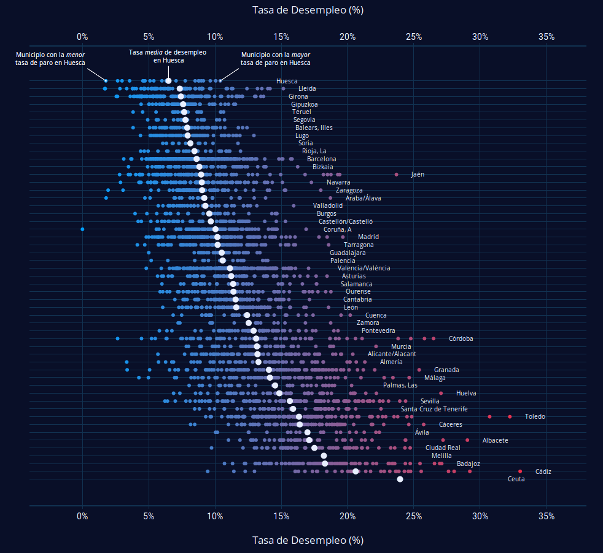
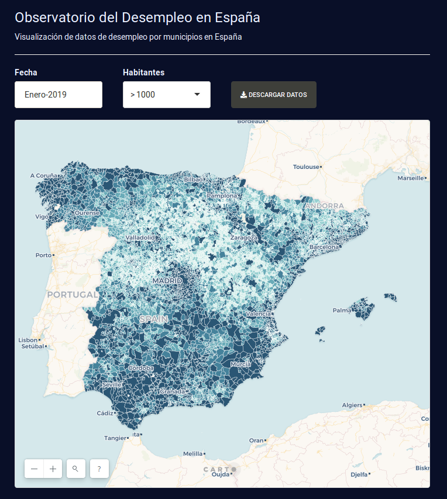
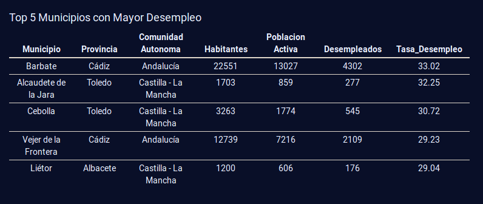
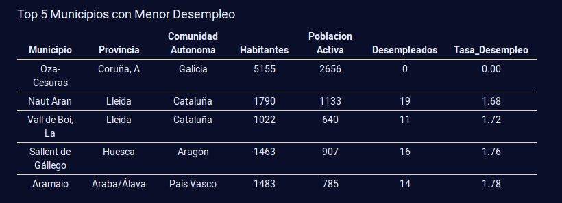
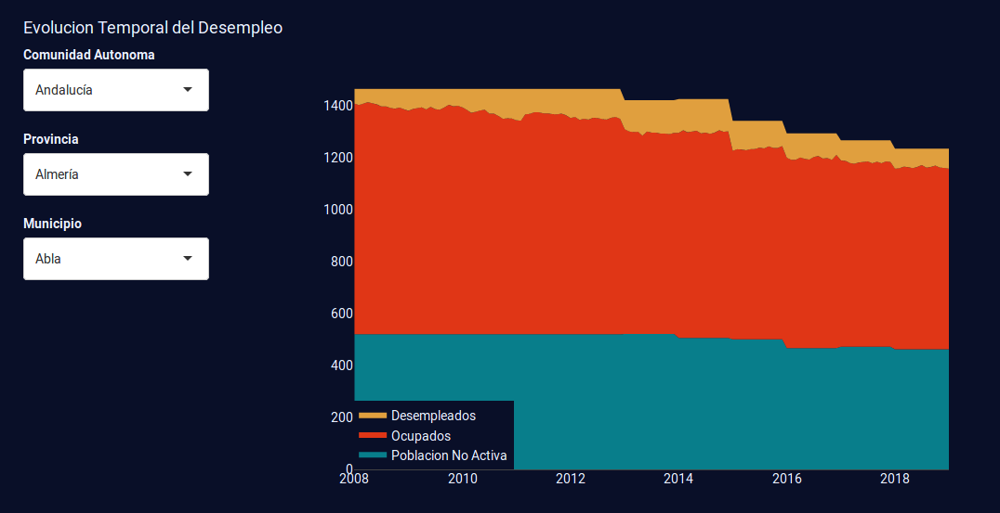
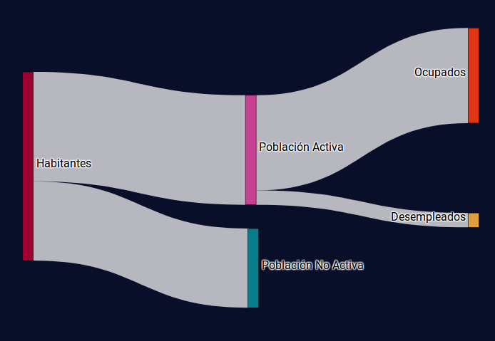

# Observatory of the Unemployment in Spain

### Summary
This repo contains the code for the **Observatory of the Unemployment in Spain**, which is available to the public [here](https://imartinezl.shinyapps.io/spain-unemployment/), hosted on [shinyapps.io](https://www.shinyapps.io/). This project attempts to bring the data of unemployment in Spain to the public in an accesible and understandable format.

The unemployment data is presented through the prism of municipalities (cities & towns). I believe that people assimilate information much better if the data concerns them closely. At national level or even at county level, it is more difficult to grasp the scale and the meaning of the numbers.

### Unemployment Rate

  

The unemployment rate is the percentage of unemployed people in the active population.
The active population is defined as people over 16 and under 65 who are working or actively seeking employment. 

Currently, the only data available to the public is the absolute number of people unemployed on each municipality, which is provided at the [Spanish Open Data repository](https://datos.gob.es/es/catalogo/e00142804-paro-registrado-por-municipios). Thus, in order to calculate the unemployment rate as was defined above, it is needed to obtain the active population per each town. 

In the absence of a municipal Labour Force Survey (LFS), the labour force data for most towns is not known. In theory, the active population is equal to the number of unemployed people in a locality plus the number of workers in that locality. The problem with this formula is that, while the registered unemployed in a locality are those who reside there, the employees registered with the Social Security are those who work in work centres belonging to that locality, but can live elsewhere.

For this reason, this calculation presents problems in:

- Those localities that have a population much higher than the number of jobs they generate. The so-called dormitory cities or residential areas.
- Those populations that, due to an important industrial zone, generate more jobs than workers, so they "import" workers, who live in another locality but every day they move to this one to work.

In other words, intermunicipal mobility affects the calculation. This mobility is much lower at the interprovincial level, so that, in principle, in the provinces it does seem correct to apply the formula proposed by the [INE](http://ine.es/) (Spanish Institute for Statistics) that says that the active population is the sum of the most employed unemployed (workers).

It is important to point out that there are different ways of calculating the unemployment rate. In fact, at European level we find that the unemployment rate in Spain varies according to the Eurostat or the INE and this is simply by the calculation method. Therefore, although the method used here is a valid method, it is not unique. By applying the same method to all localities, comparable figures are obtained.

### Municipalities Map

  

The map of the municipalities in Spain is included as well, and it is hosted on the platform [Carto](https://carto.com/). Below the municipalities map there are included the 5 municipalities with the most unemployment and the five with the least unemployment under the selected filters of time and minimum number of habitants.

  
  

### Unemployment Evolution

The evolution of the unemployed population is also accessible at a municipal level. The user is able to select the town of interest, based on the selected region and province. On the graph, there are represented three variables:
1. Non-active population
2. Occupied population
3. Unemployed population

The sum of those three quantities account for the total population of that town in a given time. The user can also click on the evolution plot and it will get a sankey-type plot that shows in a more clear way the distribution of the population.

  
  

### Built with
- [R](https://www.r-project.org/) - Programming Language / 3.5.2
- [RStudio](https://www.rstudio.com/) - IDE for R / 1.1.463 
- [dplyr](https://dplyr.tidyverse.org/) - A grammar of data manipulation / 0.7.8 
- [plotly](https://plot.ly/r/) - Library for interactive graphics / 4.8.0.9000
- [shiny](https://shiny.rstudio.com/) - Interactive web apps with R / 1.2.0
- [shinythemes](https://rstudio.github.io/shinythemes/) - Themes for Shiny / 1.1.2
- [shinycssloaders](https://github.com/andrewsali/shinycssloaders) - CSS loader animations for Shiny outputs  / 0.2.0
- [data.table](https://cran.r-project.org/web/packages/data.table/vignettes/datatable-intro.html) - Data manipulation operations / 1.12.1
- [sf](http://r-spatial.github.io/sf/) - Simple features access for R / 0.7-3
- [pxR](http://pxr.r-forge.r-project.org/) - Read PC-Axis files into R / 0.42.2
- [lubridate](https://lubridate.tidyverse.org/) - Library for date-times / 1.7.4
- [stringr](https://stringr.tidyverse.org/index.html) - Library for string manipulations / 1.4.0

